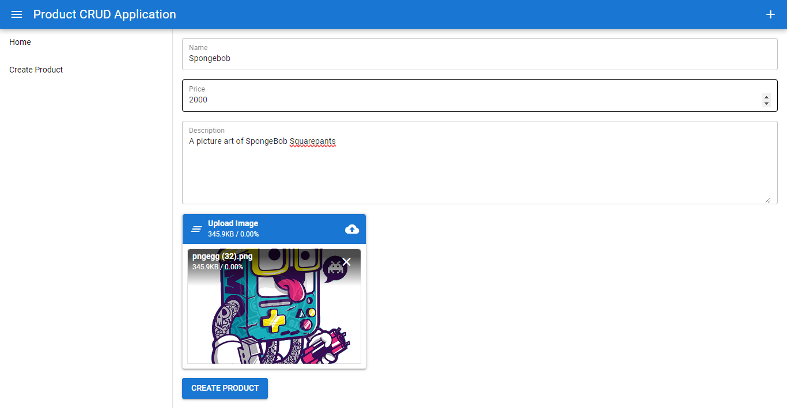

# Quasar App (quasar-crud)

A Quasar Project

# Product Management Application

## Overview
The Product Management Application is a web-based platform for managing a collection of products. It provides an intuitive interface for viewing, creating, updating, and deleting products, leveraging Vue.js and the Quasar Framework for a responsive and interactive user experience.

## Features

### Product List View
- Displays a grid of product cards, each showing an image, name, price, and description.
- Options to edit or delete each product.

  

### Create Product
- Form to add new products with fields for name, price, description, and image upload.
- Utilizes `q-uploader` for image upload, converting the image to a data URL for easy handling.

  


  ### Added Product Dispalyed

.png)

### Update Product
- Form to update existing product details, including name, price, description, and image.
- Image upload functionality to replace the existing image if a new one is provided.
- Success dialog to confirm the successful update of a product.

  

### Delete Product
- Option to delete a product from the list.

## Project Structure
- The application is structured with components for products and dialogs, managed with Vue.js data and methods.

## Technologies Used
- Vue.js: JavaScript framework for building the user interface.
- Quasar Framework: UI framework for Vue.js, providing responsive and high-performance components.
- HTML5 and CSS3: Markup and styling.

## Installation and Setup
1. Clone the repository:
   ```sh
   git clone https://github.com/your-username/product-management-app.git


## Install the dependencies
```bash
yarn
# or
npm install
```

### Start the app in development mode (hot-code reloading, error reporting, etc.)
```bash
quasar dev
```


### Lint the files
```bash
yarn lint
# or
npm run lint
```


### Format the files
```bash
yarn format
# or
npm run format
```


### Build the app for production
```bash
quasar build
```

### Customize the configuration
See [Configuring quasar.config.js](https://v2.quasar.dev/quasar-cli-vite/quasar-config-js).
